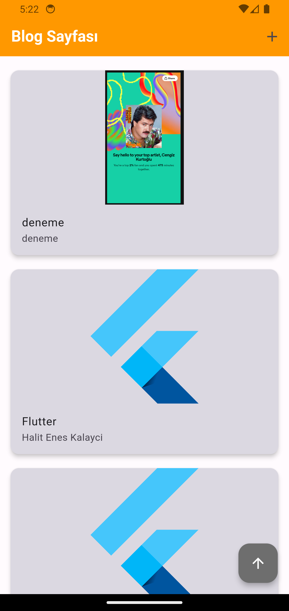
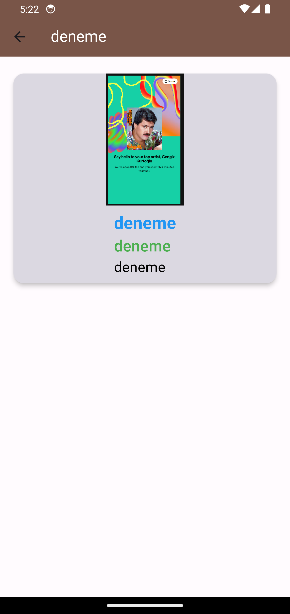
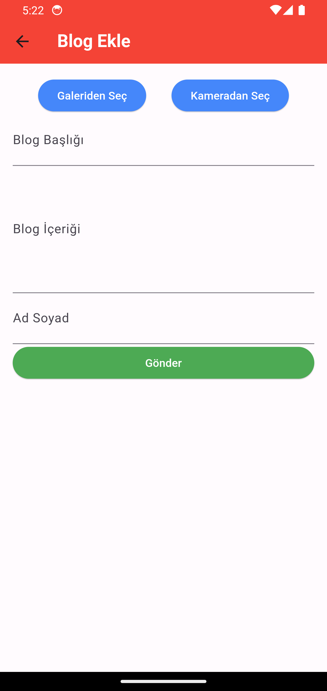

# miniblogapp

Flutter bloC pattern kullanılarak geliştirilmiş, kullanıcıların blog yazmasını sağlayan mobil uygulamadır.

## Kullanılan Teknolojiler

- Flutter: UI geliştirmek için kullanılan çerçeve.
- Bloc Pattern: State yönetimi için kullanılan Bloc kütüphanesi.
- API: Blog verilerini almak için kullanılan API.

## Özellikler
- Anasayfa: Güncel blog durumu bilgileri sunar.
- Blog Ekleme Iconu: Yebi bir blog eklenmesine yardımcı olur galeriden veya kameradan bir fotoğraf seçerek bilgilerini doldurduktan sonra ekleyebilirsiniz.
- Detaylı Bilgiler: Blog cardları hakkında detaylı bilgileri kartlara tıklayarak ulasabilirsiniz.
 

